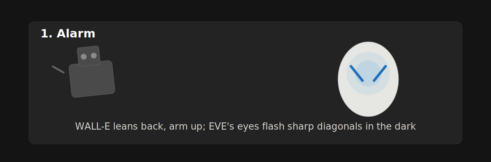
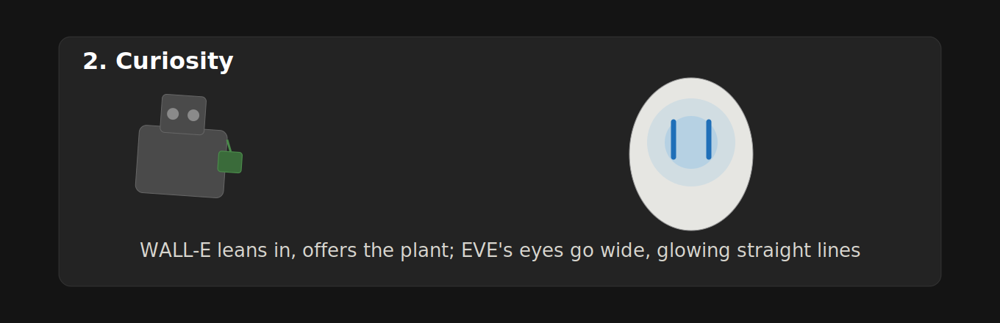
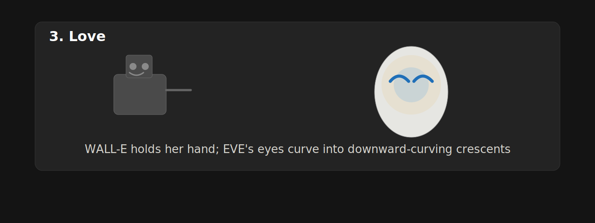
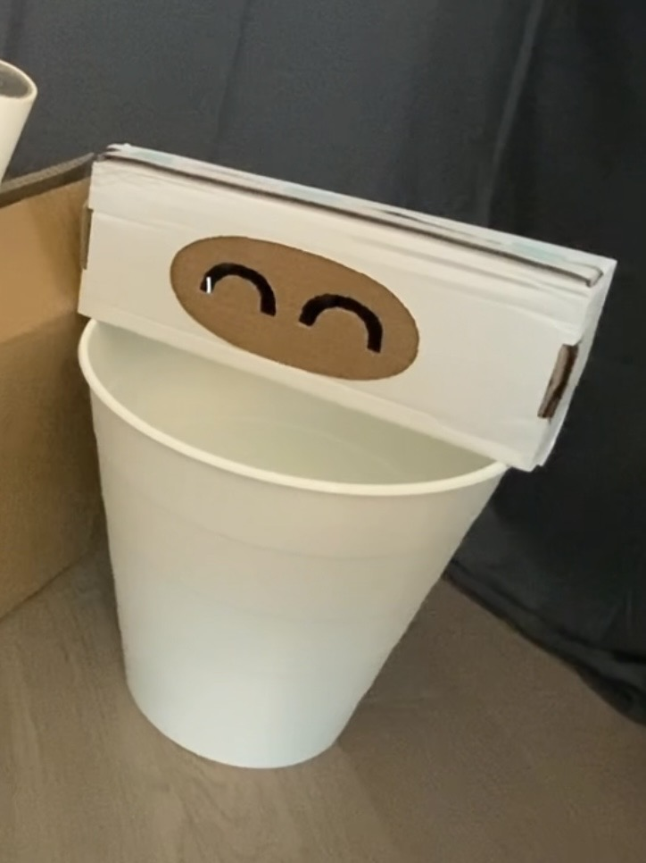

# Recreating the Masters of Interactive Light

_This project is to be done in teams of 2._

**COLLABORATOR(S):** Chih-Hsin Liu, Kelly (drop out)

**THE MASTERWORK YOU DREW FROM THE HAT:** EVE, from *WALL-E* (2008) — light-eyes that change shape to show curiosity, love, and alarm.

---

## Part 0. Know Your Master

When EVE is first seen in the movie, she is single-minded and hostile in pursuit of her directive — but curious enough to be pulled off-task by something new. When she meets WALL-E, she is wary of him and wants him out of her territory. As she learns about his curious, gentle personality, she starts to warm up to him, and once she sees how devoted he is to her, she grows close enough to make protecting him her own top priority.

The core interaction of EVE is that her eyes change shape to communicate her emotional state:

- **Curiosity:** wide, glowing straight lines (| |)
- **Love:** soft, downward-curving crescents that look like upside-down smiles (⌒ ⌒)
- **Alarm:** slanted, sharp diagonal lines angled downward toward the center (\ /)

**Strengths:** EVE's entire expressive range comes from three simple eye shapes — no dialogue, no sound — and they still read instantly to an outside viewer. That economy is what makes the emotional arc (alarm → curiosity → love) legible in a wordless scene.

**Weaknesses:** EVE's shapes are discrete and binary — her eyes snap from one state to the next with no blended, in-between shape. Any emotion or transitional beat that isn't one of the three named states has to be carried by WALL-E's reaction or body language instead of by the light itself.

## Part A. Plan

- **Setting:** A quiet corner of a cluttered room (standing in for Earth's trash-covered surface) — a desk or floor space with a few "junk" props scattered around (a box, some wires, a plant in a cup). Dim lighting so the phone's light reads clearly.
- **Players:** EVE (the phone/light), WALL-E (a human actor holding/gesturing toward the "light"), and, implicitly, the audience watching to see if the emotional arc reads clearly.
- **Activity:** WALL-E discovers EVE and cautiously approaches. EVE first reacts with alarm (threat/scan mode), then curiosity as she studies this strange creature, then — once WALL-E offers her something small and sincere, like handing her an object — shifts into love and warmth.
- **Goals:** EVE wants to protect her directive, but she's drawn to investigate anything unfamiliar. WALL-E wants connection — he's harmless and keeps trying to show it. The audience wants to see the two of them become friends.

**Three storyboards**:

1. (Alarm) WALL-E approaches — EVE's "eyes" snap to sharp downward diagonal lines; her body/light holds rigid; WALL-E freezes.
2. (Curiosity) WALL-E slowly holds out an object (e.g. a small plant or trinket) — EVE's eyes soften into wide, straight lines; she leans in slightly.
3. (Love) WALL-E does something endearing — EVE's eyes curve into the downward crescent shape; her light warms and glows softer.

_AI-assisted disclosure: these three panels were AI-polished from our own hand-drawn sketches (originals: `IMG_1149.jpg`, `IMG_1150.jpg`, `IMG_1151.jpg` in the `draft/` folder) — we drew the poses and eye-shapes ourselves and used AI to clean up the linework, layout, and captions for legibility. Used per the instructor's note that AI may be used to polish/improve parts of the work._

**Challenge:** these panels skip the cluttered-room setting from the plan above (plain dark background only, no junk props). We prioritized nailing the light behavior and WALL-E's reaction to it for this round; we'll add the room set-dressing when we physically stage the scene for Part C/D.

**Feedback:** A classmate recognized EVE immediately just from the eye/head silhouette, so the character design was legible on its own. Their main notes were that the Curiosity eye-shape (straight lines) read as more surprised than actively curious, and that the plain black background may not be able to create a proper environment like the movie.
We kept the storyboards and eye-shape vocabulary as-is for this round because the three states were already locked into the physical build by the time this feedback came in.

## Part B. Act out the Interaction

**Are there things that seemed better on paper than when acted out?**
To act out EVE, since the eyes are not always open and they have various shapes, I need to cut different shapes into a dark-colored paperboard to make them look similar to the real eye shapes. This is what I didn't expect in the initial planning phase. Also, the mechanism of changing the shape of EVE's eyes takes time — so far, the best approach I can manage with the materials I have still needs post-processing to cut out the small intervals in the video where I swap different paperboard cutouts attached to EVE's head.

**Did new ideas about the piece surface once you were on your feet?**
Originally, I wanted to act out WALL-E myself, but it's awkward to stand next to the small EVE I created. To recreate the scale from the movie, I came up with the idea of using another box similar in size to EVE to play WALL-E instead.

**Are there key moments in the interaction where things could go in a different direction?**
We didn't hit an obvious branch point in this pass. Only one thing to note: Alarm to Curiosity fork: if WALL-E approached too fast or didn't back off after EVE's first alarm flash, would EVE escalate instead of settling into curiosity once he slows down?

## Part C. Prototype the Light (light first!)

I used the Tinkerbelle tool: the phone in the browser was the light, and the laptop drove its brightness and color. Because a member of my group dropped the class, I worked solo — a cardboard box stood in for WALL-E while I hid behind the camera operating both "characters": swapping EVE's cardboard eyepiece and driving the laptop.

I placed a decorated phone inside EVE's head as the light source and recorded with a separate iPad, with the camera framing fixed on the "stage." When WALL-E moved, I swapped the cardboard eye cutout and brought EVE's light back up in response. During each transition, I let the light drop back to darkness first — which turned out to double as a fix for the visible-swap problem from Part B: the blackout hides the cutout change instead of needing to cut it out in post.

## Part D. Wizard the Device

Since I had to manipulate both characters and the light by myself, I realized I needed extra tools to act as my "wizard" hands. First, I cut a hole in the back of EVE's head (the back of the box). Then I attached thread to each eye cutout, so I could feed a cutout in through the hole to mask part of the light — swapping shapes from behind, out of camera view, without needing a second hidden operator.

[First wizarded test (thread mechanism)](https://drive.google.com/file/d/1p5qiOYhlMKaVDwcXsY4QcqmFoadIuf8e/view?usp=sharing)

## Part E. (optional) Costume the Device

Mostly my cardboard EVE box with cutout eye shapes is the same as the costume I designed on the storyboard. However, in the movie, EVE has a white body, so I used a white trash bin as her body. This actually brought benefits because I could directly put EVE's head above it without additional design.

## Part F. Record

[Final video sketch](https://drive.google.com/file/d/1XbkrWZS8Z7kvTFeRek_KXNsIm7_a2lhe/view?usp=sharing)

This project was originally planned as a team of two; my partner dropped the course before Part B, so I completed Parts B through F solo — building EVE's cardboard body, the thread-and-cutout eye mechanism, and operating both "characters" during filming.

---

# Part 2 — ReMastering the light

*This describes the second week's work for this lab activity.*

## Prep (before the next lab)

Find three other groups. (How? Maybe Slack?) Visit their Lab Hub pages, watch their
videos, and give them reactions and feedback: tell them what you saw happening,
guess the masterwork and the goals of the characters, and ask about anything that
wasn't clear.

**Who were the other groups you kibitzed with? Add links to their project pages here.**
**Summarize the feedback you got from your partners here.**

## Remix, Update, or Critique the Master

Now that you understand your masterwork from the inside, respond to it. Do the
recreation again, but this time make it your own — pick one of these moves (or
combine them):

1. **Remix the modality.** Your recreation no longer has to (just) use light. Use
   vibration, sound, motion, heat — whatever best carries the interaction. Feel
   free to fork and modify the Tinkerbelle code. (Add your updates to this lab's folder!)
2. **Update it.** Redesign the piece for today's context, or for a setting its
   creators never imagined (the piece with roommates in the room, with children
   present, on a phone, in a car).
3. **Fix its weaknesses.** You identified this master's strengths and weaknesses
   in Part 0 — now address a weakness, or push a strength further.

We will grade this second pass with an emphasis on **creativity** and on how well
your response engages with what your master was really doing.

**Document everything here — especially the storyboard and video. Photos of the
prototype are great too.**

---

*Assignment lineage: this lab merges "Staging Interaction" (Interactive Lab Hub)
with "Recreating the Masters" (Interaction Design Studio, Profs. Scott Minneman &
Wendy Ju). Massive list of interactive light masterworks generated by Claude.ai.*
