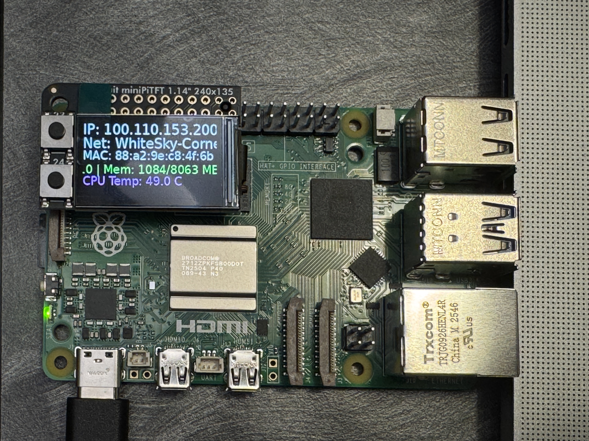
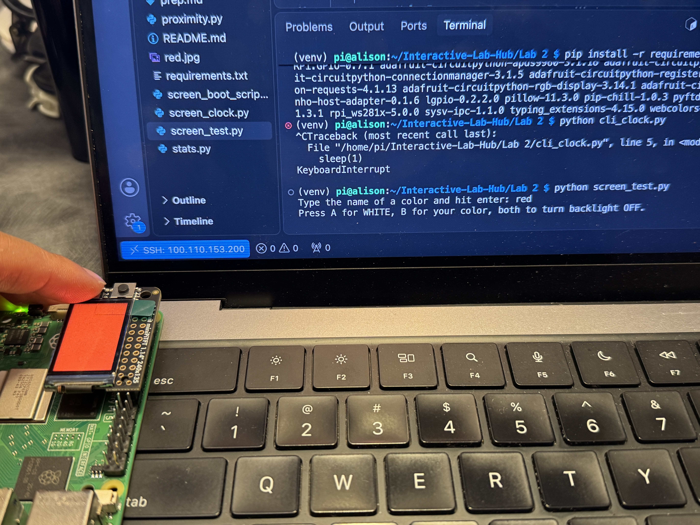
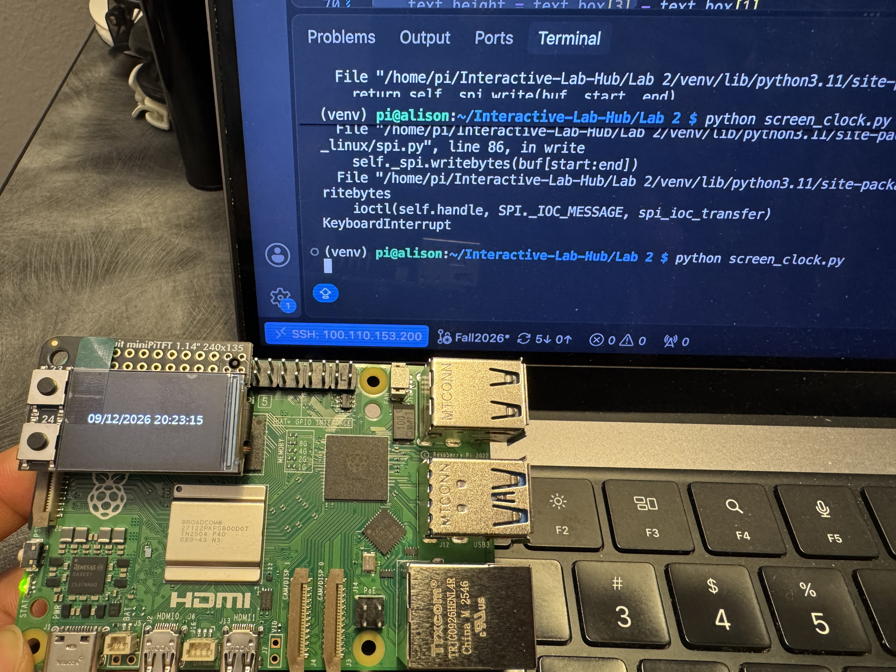
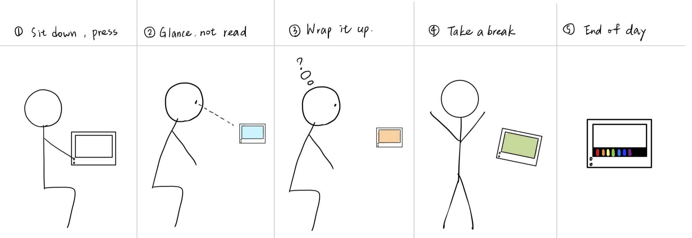
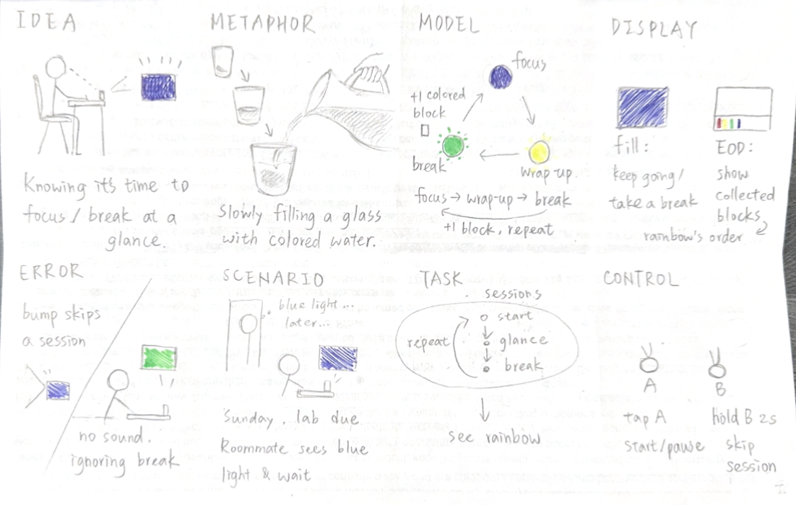

# Interactive Prototyping: The Clock of Pi
**NAMES OF COLLABORATORS HERE**

Does it feel like time is moving strangely during this semester?

For our first Pi project, we will pay homage to the [timekeeping devices of old](https://en.wikipedia.org/wiki/History_of_timekeeping_devices) by making simple clocks.

It is worth spending a little time thinking about how you mark time, and what would be useful in a clock of your own design.

**Please indicate anyone you collaborated with on this Lab here.**
Be generous in acknowledging their contributions! And also recognizing any other influences (e.g. from YouTube, Github, Twitter) that informed your design. 

## Prep

1. ### Set up your Lab 2 Github

**📖 [Follow the step-by-step guide for safely updating your fork](pull_updates/README.md)**

This guide covers how to pull updates without overwriting your completed work, handle merge conflicts, and recover if something goes wrong.


2. ### Get Kit and Inventory Parts
Take inventory of the kit parts that you have, and note anything that is missing:

***Update your [parts list inventory](partslist.md)***

3. ### Prepare your Pi for lab this week
[Follow these instructions](prep.md) to download and burn the image for your Raspberry Pi before lab Wednesday.


## Overview
For this assignment, you are going to 

A) [Connect to your Pi](#part-a)  

B) [Try out cli_clock.py](#part-b) 

C) [Set up your RGB display](#part-c)

D) [Try out clock_display_demo](#part-d) 

E) [Modify the code to make the display your own](#part-e)

F) [Make a short video of your modified barebones PiClock](#part-f)

G) [Sketch and brainstorm further interactions and features you would like for your clock for Part 2.](#part-g)

## The Report
This readme.md page in your own repository should be edited to include the work you have done. You can delete everything but the headers and the sections between the \*\*\***stars**\*\*\*. Write the answers to the questions under the starred sentences. Include any material that explains what you did in this lab hub folder, and link it in the readme.

Labs are due on Sunday midnight. Make sure this page is linked to on your main class hub page.

## Part A. 
### Connect to your Pi
Just like you did in the lab prep, ssh on to your pi. Once you get there, create a Python environment (named venv) by typing the following commands.

```
ssh pi@<your Pi's IP address>
...
pi@raspberrypi:~ $ python -m venv venv
pi@raspberrypi:~ $ source venv/bin/activate
(venv) pi@raspberrypi:~ $ 

```
### Setup Personal Access Tokens on GitHub
Set your git name and email so that commits appear under your name.
```
git config --global user.name "Your Name"
git config --global user.email "yourNetID@cornell.edu"
```

The support for password authentication of GitHub was removed on August 13, 2021. That is, in order to link and sync your own lab-hub repo with your Pi, you will have to set up a "Personal Access Tokens" to act as the password for your GitHub account on your Pi when using git command, such as `git clone` and `git push`.

Following the steps listed [here](https://docs.github.com/en/authentication/keeping-your-account-and-data-secure/managing-your-personal-access-tokens) from GitHub to set up a token. Depends on your preference, you can set up and select the scopes, or permissions, you would like to grant the token. This token will act as your GitHub password later when you use the terminal on your Pi to sync files with your lab-hub repo.


## Part B. 
### Try out the Command Line Clock
Clone your own lab-hub repo for this assignment to your Pi and change the directory to Lab 2 folder (remember to replace the following command line with your own GitHub ID):

```
(venv) pi@raspberrypi:~$ git clone https://github.com/<YOURGITID>/Interactive-Lab-Hub.git
(venv) pi@raspberrypi:~$ cd Interactive-Lab-Hub/Lab\ 2/
```
Depends on the setting, you might be asked to provide your GitHub user name and password. Remember to use the "Personal Access Tokens" you just set up as the password instead of your account one!

Check if the directory has clone sucessfully, you should see the Interactive-Lab-Hub under the home directory listed:
```
(venv) pi@raspberrypi:~ $ ls
Bookshelf      Documents            Music     Public                 venv
create_img.sh  Downloads            pi-apps   screen_boot_script.py  Videos
Desktop        Interactive-Lab-Hub  Pictures  Templates
(venv) pi@raspberrypi:~ $
```


Install the packages from the requirements.txt and run the example script `cli_clock.py`:

```
(venv) pi@raspberrypi:~/Interactive-Lab-Hub/Lab 2 $ pip install -r requirements.txt
(venv) pi@raspberrypi:~/Interactive-Lab-Hub/Lab 2 $ python cli_clock.py 
02/24/2021 11:20:49
```

The terminal should show the time, you can press `ctrl-c` to exit the script.
If you are unfamiliar with the Python code in `cli_clock.py`, have a look at [this Python refresher](https://hackernoon.com/intermediate-python-refresher-tutorial-project-ideas-and-tips-i28s320p). If you are still concerned, please reach out to the teaching staff!


## Part C. 
### Set up your RGB Display
We have asked you to equip the [Adafruit MiniPiTFT](https://www.adafruit.com/product/4393) on your Pi in the Lab 2 prep already. Here, we will introduce you to the MiniPiTFT and Python scripts on the Pi with more details.


The Raspberry Pi 5 has a variety of interfacing options. When you plug the pi in the red power LED turns on. Any time the SD card is accessed the green LED flashes. It has standard USB ports and HDMI ports. Less familiar it has a set of 20x2 pin headers that allow you to connect a various peripherals.


To learn more about any individual pin and what it is for go to [pinout.xyz](https://pinout.xyz/pinout/3v3_power) and click on the pin. Some terms may be unfamiliar but we will go over the relevant ones as they come up.

### Hardware (you have already done this in the prep)

From your kit take out the display and the [Raspberry Pi 5](https://www.google.com/url?sa=i&url=https%3A%2F%2Fwww.raspberrypi.com%2Fproducts%2Fraspberry-pi-5%2F&psig=AOvVaw330s4wIQWfHou2Vk3-0jUN&ust=1757611779758000&source=images&cd=vfe&opi=89978449&ved=0CBMQjRxqFwoTCPi1-5_czo8DFQAAAAAdAAAAABAE)

Line up the screen and press it on the headers. The hole in the screen should match up with the hole on the raspberry pi.

<p float="left">


</p>

### Testing your Screen

The display uses a communication protocol called [SPI](https://www.circuitbasics.com/basics-of-the-spi-communication-protocol/) to speak with the raspberry pi. We won't go in depth in this course over how SPI works. The port on the bottom of the display connects to the SDA and SCL pins used for the I2C communication protocol which we will cover later. GPIO (General Purpose Input/Output) pins 23 and 24 are connected to the two buttons on the left. GPIO 22 controls the display backlight.

To show you the IP and Mac address of the Pi to allow connecting remotely we created a service that launches a python script that runs on boot. For the following steps stop the service by typing ``` sudo systemctl stop piscreen.service --now```. Othwerise two scripts will try to use the screen at once. You may start it again by typing ``` sudo systemctl start piscreen.service --now```

We can test it by typing 
```
(venv) pi@raspberrypi:~/Interactive-Lab-Hub/Lab 2 $ python screen_test.py
```

You can type the name of a color then press either of the buttons on the MiniPiTFT to see what happens on the display! You can press `ctrl-c` to exit the script. Take a look at the code with
```
(venv) pi@raspberrypi:~/Interactive-Lab-Hub/Lab 2 $ cat screen_test.py
```

#### Displaying Info with Texts
You can look in `screen_boot_script.py` for how to display text on the screen!

#### Displaying an image

You can look in `image.py` for an example of how to display an image on the screen. Can you make it switch to another image when you push one of the buttons?

\*\*\***Include a picture of your own Raspberry Pi displaying the piscreen.service with your unique MAC address. Additionally, please provide another picture showing the successful completion of the screen test.**\*\*\*
1. Raspberry Pi displaying the piscreen

2. Screen test


## Part D. 
### Set up the Display Clock Demo
Work on `screen_clock.py`, try to show the time by filling in the while loop (at the bottom of the script where we noted "TODO" for you). You can use the code in `cli_clock.py` and `stats.py` to figure this out.


## Part E. Read Part 2. Sketch and brainstorm further interactions and features you would like for your clock.

One potential source of ideas might be thinking about other clocks and timekeeping devices for inspiration.

Another might be novel units of time. How do you measure a year? [In daylights? In midnights? In cups of coffee?](https://www.youtube.com/watch?v=wsj15wPpjLY)

We strongly discourage literal digital or analog clock display: Be creative.

### Idea: Color Pomodoro Timer

Unlike the official pompdprp timer, this is a focus timer that tells time **only with color**. It uses nothing but the Pi and the MiniPiTFT: the full screen plus its two buttons.

**Why color instead of numbers?**

- **Glanceable, not readable.** Sometimes a countdown like `01:30` pulls your eyes and attention away from your work. This color timer can be read with peripheral vision: "still blue" means keep going, and you never have to look at it directly.
- **Less clock-watching.** Without numbers, there's nothing to keep checking. The screen only asks you to act when the color changes.
- **A signal to others.** A roommate can see "blue = focusing, don't interrupt" from across the room.
- **Fits the hardware.** At 240×135, text is cramped, but a full-screen color is bright and readable from far away.

**Reward:** Every finished focus session collects one color of the rainbow (red → orange → yellow → green → blue → indigo → violet) in a thin strip at the bottom of the screen. Seven sessions, about three hours of real focus, complete one rainbow, and the whole screen celebrates with a full rainbow. A half rainbow is still a good day!

### How it behaves

| State | Color on screen | What it means |
|---|---|---|
| Idle | Soft white | Ready; press A to start |
| Focus (25 min) | Blue | Focus |
| Wrap-up (last 2 min) | Amber, gently "breathing" | Finish your current thought |
| Break (5 min) | Green | Stand up, look away, stretch |
| Paused | Dim grey | Timer stopped |

**Controls**

- **Button A:** tap to start or pause.
- **Button B:** hold for 2 seconds to **skip ahead** to the next session. The hold keeps a bumped button from ending a session by accident.

### Storyboard



### Verplank diagram



### Plan for Part 2

- **Start from something small:** Blue fill during focus, then green during break, with button A to start or pause. This only needs a color-mapping function and a timer inside the `while` loop of `screen_clock.py`.
- **Possible later extensions (not required):** Flip the Pi face-down to start a session, like turning a phone over (IMU). Auto-pause when I leave my desk (proximity sensor).

**Put the names of the people you gave feedback to here. (Even better, add links to their repos here!)**

- https://github.com/Tzuyi-Wei/Interactive-Lab-Hub/tree/Fall2026/Lab%202
- https://github.com/ctyaaaaao/Interactive-Lab-Hub/blob/Fall2026/Lab%202
- https://github.com/vd269-dot/Vasudha-Lab-Hub/tree/Fall2026/Lab%202

# Lab 2 Part 2

## Prep 

1. Pick up remaining parts for kit on Wednesday lab class. Check the updated [parts list inventory](partslist.md) and let the TA know if there is any part missing.

2. Look at and give feedback on the Part E. for at least 3 other people in the class and get 3 people to comment on your Part E!)
**Put the feedback for your ideas here.**

1. "The overall design is nicely minimalist, and I love the rainbow display. It's a great draw that keeps users engaged. However, I'd suggest making it more intuitive (like add simple words), as it might be hard for people to tell which color corresponds to which function."
2. "It uses color to let users know whether they need to continue focusing, while retaining the characteristics of the Pomodoro Technique... However, when users only want to focus for an hour, it seems the only option is to use the pause function."
3. "A great idea to less stressfully manage time! The end of the day summary could maybe add suggestions so that users could start modifying their habits."

See [Updated plan (based on feedback)](#updated-plan-based-on-feedback) below.

## Update your Lab Hub

[Update your Lab Hub](pull_updates/README.md) to get the latest content and requirements for Part 2.

## Modify the barebones clock to make it your own

Start small, pick just one element of your overall idea, just to show you have a handle on the code and components.

\*\*\***Put a copy of your code in your Lab 2 Github repo.**\*\*\*

## Make a short video of your modified barebones PiClock

\*\*\***Take a video of your barely modified PiClock.**\*\*\*

After you edit and work on the scripts for Lab 2, the files should be upload back to your own GitHub repo! You can push to your personal github repo by adding the files here, commiting and pushing.

```
(venv) pi@raspberrypi:~/Interactive-Lab-Hub/Lab 2 $ git add .
(venv) pi@raspberrypi:~/Interactive-Lab-Hub/Lab 2 $ git commit -m 'your commit message here'
(venv) pi@raspberrypi:~/Interactive-Lab-Hub/Lab 2 $ git push
```

After that, Git will ask you to login to your GitHub account to push the updates online, you will be asked to provide your GitHub user name and password. Remember to use the "Personal Access Tokens" you set up in Part A as the password instead of your account one! Go on your GitHub repo with your laptop, you should be able to see the updated files from your Pi!

## Now, make your own PiClock

Do take advantage of having done the previous iteration to refine and simplify your design.

** Insert any updates ideas, sketches, [Verplank diagrams](https://ccrma.stanford.edu/courses/250a-fall-2004/IDSketchbok.pdf))!, storyboards for your ideas **

### Updated plan (based on feedback)

The three pieces of feedback asked for clearer color meanings, more than one session length, and a more useful end-of-day summary. I kept the focus screen plain color and added information only at moments when I'm not focusing: phase changes, the idle screen, and the end of the day.

#### 1. Words at every phase change

When a phase starts, the screen shows its name in big letters for about 3 seconds. After that, the whole screen is filled with the phase color.

| Phase | Word shown first | Then the screen is |
|---|---|---|
| Focus | **FOCUS** | Solid blue |
| Wrap-up (last 2 min of focus) | **WRAP UP** | Solid amber, gently breathing |
| Break | **BREAK** | Solid green |
| Paused | **PAUSED** | Solid grey |

New users learn what each color means from the word, and once they know it, the color alone is enough.

#### 2. Two session lengths

On the idle screen, **tap B** to switch between two lengths. The choice is shown in words (**30 MIN** / **60 MIN**). Tap A to start.

| Length | Focus (incl. 2 min wrap-up) | Break | Rainbow colors earned |
|---|---|---|---|
| **30 MIN** | 25 min | 5 min | 1 |
| **60 MIN** | 45 min | 15 min | 2 |

A **counter** (0–7) tracks the rainbow. A finished 30-minute cycle adds 1 color and a 60-minute cycle adds 2, so a longer session isn't punished. The counter stops at 7, and reaching 7 plays the full-screen rainbow.

**Skip rules** (hold B for 2 seconds during a session):

- Skip during **blue focus** → go straight to the break, **no color** earned. This counts as a skipped focus session.
- Skip during **amber wrap-up** → the session is basically done, so the color still counts.
- Skip during **break** → back to idle. This counts as a skipped break.

#### 3. End-of-day summary

The summary appears automatically when the rainbow is complete, and I can also open it any time by **holding A for 2 seconds on the idle screen**. It shows the collected rainbow plus one short tip. If the rainbow is full, the summary starts with the celebration message. Then it shows the first tip below whose rule matches:

| What the clock noticed | Tip on screen |
|---|---|
| Full rainbow (7 colors) | *"Nice! Same plan tomorrow?"* |
| 2+ skipped breaks | *"Try taking your breaks"* |
| 2+ focus sessions skipped during blue | *"Try shorter sessions"* |
| Most colors earned before noon | *"Mornings work for you"* |
| Nothing above matches | *"Keep going tomorrow"* |

To make this work, the program logs each finished or skipped session with its time of day. With only the screen and two buttons, the clock can't tell whether I actually got up during a break, so "ignored breaks" only counts breaks I skipped with B.

#### Build order

流程：一整輪結束才回 idle

Idle（白）→ Focus（藍）→ Wrap-up（琥珀）→ Break（綠）→ 回到 Idle（白）

Focus 到 Wrap-up：自動接上。 琥珀色是專心的最後 2 分鐘，不算另一個獨立的段落。
Wrap-up 到 Break：自動接上。 螢幕先顯示 BREAK，再變成綠色。
Break 結束才回 Idle。 這時彩虹多一個顏色，等你按 A 開始下一輪，或按 B 換 30/60。

1. **Barebones:** blue → green with A to start or pause, plus the phase words.
2. **Core:** 30/60 selection, amber wrap-up, paused state, the hold-B skip, and the rainbow counter with its celebration.
3. **Extra:** session log and end-of-day summary with tips.


\*\*\***Put a copy of your code in your Lab 2 Github repo.**\*\*\*

\*\*\***Take a video of your PiClock.**\*\*\*


As always, make sure you document contributions and ideas from others (and AI) explicitly in your writeup.

You are permitted (but not required) to work in groups and share a turn in; you are expected to make equal contribution on any group work you do, and N people's group project should look like N times the work of a single person's lab.  Make sure the page for the group turn in is linked to your personal Interactive Lab Hub page. 


