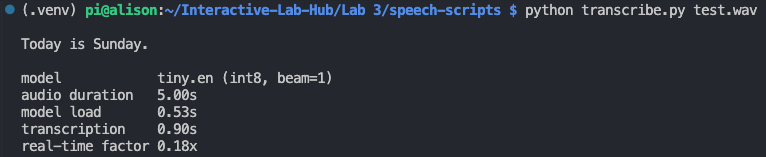
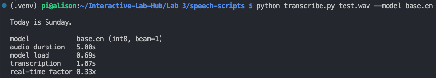
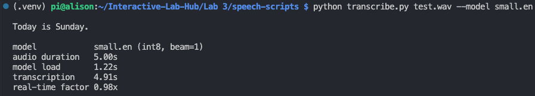
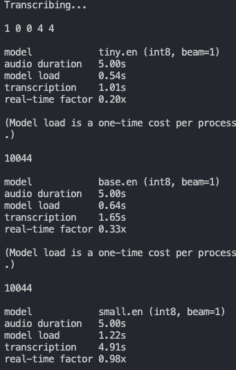
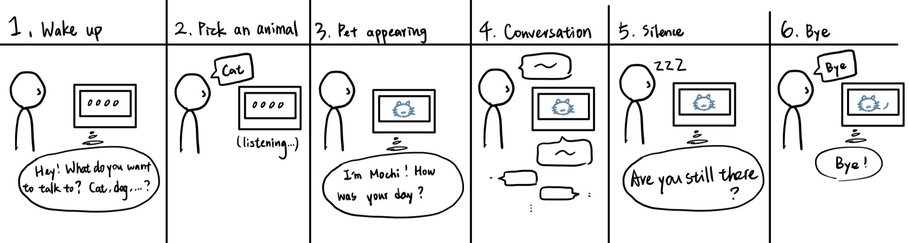

# Chatterboxes

**NAMES OF COLLABORATORS HERE**

[](https://www.youtube.com/embed/Q8FWzLMobx0?start=19)

In this lab, we want you to design interaction with a speech-enabled device — something that listens and talks to you. This device can do anything *but* control lights (since we already did that in Lab 1). First, we want you to storyboard what you imagine the conversational interaction to be like. Then you will use wizarding techniques to elicit examples of what people might say, ask, or respond. We then want you to use the examples collected from at least two other people to inform the redesign of the device.

We will focus on **audio** as the main modality for interaction to start; these general techniques can be extended to **video**, **haptics** or other interactive mechanisms in the second part of the Lab.

A note on what you are building with. Speech interfaces are usually taught as two boxes — speech-in, speech-out — and that framing hides the part that actually determines whether an interaction works. Between listening and speaking sits the question of **whose turn it is**: when does the device decide you have finished talking, and how long does it make you wait before it answers? This lab gives you direct control over both, and we will ask you to notice what changes when you move them.

## Prep for Part 1: Get the Latest Content and Pick up Additional Parts

Please check instructions in [prep.md](prep.md) and complete the setup.

### Pick up Web Camera If You Don't Have One

Students who have not already received a web camera will receive their Webcam and at the beginning of lab. If you cannot make it to class this week, please contact the TAs to ensure you get these.

### Get the Latest Content

As always, pull updates from the class Interactive-Lab-Hub to both your Pi and your own GitHub repo.

**\[recommended\]** Option 1: On the Pi, `cd` to your `Interactive-Lab-Hub`, pull the updates from upstream (class lab-hub) and push the updates back to your own GitHub repo. You will need the *personal access token* for this.

```
pi@ixe00:~$ cd Interactive-Lab-Hub
pi@ixe00:~/Interactive-Lab-Hub $ git pull upstream Fall2026
pi@ixe00:~/Interactive-Lab-Hub $ git add .
pi@ixe00:~/Interactive-Lab-Hub $ git commit -m "get lab3 updates"
pi@ixe00:~/Interactive-Lab-Hub $ git push
```

Option 2: On your own GitHub repo, create a pull request to get updates from the class Interactive-Lab-Hub. After you have the latest updates online, go to your Pi, `cd` to your `Interactive-Lab-Hub` and use `git pull`.

---

# Part 1

## Setup

Create and activate a virtual environment for this lab:

```
pi@ixe00:~$ cd Interactive-Lab-Hub/Lab\ 3
pi@ixe00:~/Interactive-Lab-Hub/Lab 3 $ python3 -m venv .venv
pi@ixe00:~/Interactive-Lab-Hub/Lab 3 $ source .venv/bin/activate
(.venv) pi@ixe00:~/Interactive-Lab-Hub/Lab 3 $
```

Install the Python dependencies:

```
(.venv) $ pip install -r requirements.txt
```

This takes a few minutes. If you would like it to take considerably less time, [`uv`](https://docs.astral.sh/uv/) is a drop-in replacement for `pip` that is dramatically faster on the Pi:

```
(.venv) $ pip install uv && uv pip install -r requirements.txt
```

Then run the setup script, which installs the classic speech synthesizers, downloads the voice activity detection model, and pre-fetches a neural voice and a speech recognition model so you are not waiting on downloads during lab:

```
(.venv):~$ cd speech-scripts
(.venv) $ ./setup.sh
```

Check your audio devices before going further. `arecord -l` lists capture devices and `aplay -l` lists playback devices; if your webcam microphone or Bluetooth speaker does not appear, fix that first — every script below assumes the system defaults are the ones you want.

## A. Text to Speech

Your Pi can speak in several quite different ways, and the differences are audible in a way that matters for design. In `speech-scripts/` there are shell scripts for each.

### The classic engines

```
(.venv) $ cd speech-scripts

(.venv) $ sudo apt update
(.venv) $ sudo apt install -y espeak festival festvox-kallpc16k

(.venv) $ ./espeak_demo.sh
(.venv) $ ./festival_demo.sh
```

You can run these `.sh` files by typing `./filename`, and read one with `cat filename`. You can also play audio files directly with `aplay filename` — try `aplay lookdave.wav`.

These are all decades-old technology and they sound like it. `espeak-ng` is a *formant synthesizer*: it generates speech from an acoustic model of the vocal tract, which is why it sounds robotic but also why the whole thing fits in a couple of megabytes and responds instantly. `festival` is *concatenative*: they stitch together recorded fragments of a real speaker, which sounds more human but breaks audibly at the seams.

### Neural TTS with Piper

Note that the Piper command line changed in version 1.x — voices are now downloaded explicitly with `python3 -m piper.download_voices`, and you invoke it as `python3 -m piper`. Tutorials you find online may show the old `echo ... | piper --model ...` form, which no longer works. Browse the [voice samples](https://rhasspy.github.io/piper-samples) and download a different one if you'd like:

```
(.venv) $ python3 -m piper.download_voices en_US-lessac-medium
```

[Piper](https://github.com/OHF-Voice/piper1-gpl) synthesizes speech with a small neural network, runs comfortably on the Pi 5, and sounds markedly better than the above.

```
(.venv) $ ./piper_demo.sh
```

The demo script also shows `--output-raw`, which streams audio to the speaker as it is generated rather than writing a file first. Listen for the difference in how quickly speech begins. In a conversational system this gap is the thing your user experiences as responsiveness.

\*\***Write your own shell file to use your favorite of these TTS engines to have your Pi greet you by name.**\*\*
(This shell file should be saved to your own repo for this lab.)
The shell file I wrote is [here](speech-scripts/my_greeting.sh)

\*\***Then answer: Is the same greeting, in these different voices, the same greeting? Describe one concrete way the voice changed what the utterance seemed to mean or who seemed to be speaking.**\*\*
The words were the same, but the greeting did not feel identical. I feel the espeak sounded very robotic and not easy to understand beceause the pause is not natural.
Piper sounded a little bit warmer and natural. For me, espeack is like a robot system reading notification, while Piper is more like a personal assistant.

## B. Speech to Text

We use [faster-whisper](https://github.com/SYSTRAN/faster-whisper), a reimplementation of OpenAI's Whisper model that runs several times faster on CPU and does not require PyTorch. All processing happens on the Pi; nothing is sent to a server.

```
(.venv) $ python transcribe.py lookdave.wav
```

The transcript is not the interesting output here — the timings are. Run it again with a larger model and compare:

```
(.venv) $ python transcribe.py lookdave.wav --model base.en
(.venv) $ python transcribe.py lookdave.wav --model small.en
#  noted that the first run may take longer because the model is downloaded, and that the HF unauthenticated-request warning is expected and not an error.
```

Available sizes, smallest first: `tiny.en`, `base.en`, `small.en`, `medium.en`. The `.en` variants are English-only and faster than their multilingual counterparts at the same size.

\*\***Record a few seconds of your own speech (`arecord -d 5 -f cd -c 1 -r 16000 test.wav`) and transcribe it with at least two model sizes. Report the real-time factor for each. At what point does the accuracy improvement stop being worth the delay, for a system that has to answer you?**\*\*






The results were:
- Tiny.en: real-time factor = 0.18x, transcription time: 0.90s
- Base.en: real-time factor = 0.33x, transcription time: 1.67s
- Small.en: real-time factor = 0.98x, transcription time: 4.91s
The transcript for all was the same: “Today is Sunday.” The main difference was latency that larger model was much slower. When we reached small.en, I start to feel an noticeable delayed. For a system that has to answer quickly, the accuracy improvement from tiny.en to base.en is probably worth it, but the jump to small.en is not worth the extra delay because it takes almost 5 seconds to transcribe a 5-second recording, which is a real-time factor of about 1.0x.

\*\***Write your own script that verbally asks for a numerical input (a phone number, zipcode, number of pets) and records the answer the respondent provides.**\*\* Numbers are a good stress test — transcription systems make characteristic errors on digit strings, and you will want to know what they are before you design around them.



The system recognized the zip code correctly, but the tiny model inserted spaces between digits (for example, “1 0 0 4 4” instead of “10044”). This may explain why numeric inputs need post-processing or confirmation in a conversational system.

## C. Turn-taking: knowing when someone has stopped talking

Everything so far has worked on fixed audio files. A real conversational device does not get told when to start and stop recording — it has to decide. This is the problem that makes speech interfaces hard, and it is mostly not a speech recognition problem.

We use a **voice activity detector** (VAD) to segment the microphone stream into utterances. `listen.py` runs Silero VAD continuously and hands each detected utterance to faster-whisper:

```
(.venv) $ cd speech-scripts
(.venv) $ python listen.py
```

Speak, pause, and watch it transcribe. Now change the endpointing threshold — the amount of silence the system requires before it decides your turn is over:

```
(.venv) $ python listen.py --min-silence 0.2
(.venv) $ python listen.py --min-silence 1.5
```

\*\***Try both extremes, and something in between. Describe what each one feels like to talk to. Note specifically: at 0.2s, what kinds of normal speech get cut off? At 1.5s, what does the delay make the system seem like?**\*\*

I preferred the 0.2-second threshold system. It felt more responsive and natural. The 1.5-second threshold felt much slower and made the device seem hesitant or delayed. I feel like I have to stop my sentence and pause to make it start transcribing.
However, at 0.2s, short pauses inside normal speech when I was still thinking about the following sentences were sometimes treated as the end of my turn, causing the system to cut off phrases mid-sentence. At 1.5s, the delay, in my opinion, was awkward that made the device seem less conversational.

### The complete loop

`echo_bot.py` puts the pieces together: it listens, endpoints, transcribes, and speaks a reply through Piper. The dialogue policy is deliberately trivial — it repeats what you said — so that everything you notice is a property of the timing rather than the content.

```
(.venv) $ python echo_bot.py
```

## D. Storyboard

Storyboard and/or use a Verplank diagram to design a speech-enabled device. (Stuck? Make a device that talks for dogs. If that is too stupid, find an application that is better than that.)



This storyboard shows a speech-enabled device that lets the user choose an animal companion and have a short conversation with it. The device is designed to provide a simple feeling of companionship when the user wants to talk.

1. **Wake up:** The device asks what the user would like to talk about.
2. **Choose an animal:** The user says an animal, such as “cat” or “dog.” The device displays a listening state while waiting for the answer.
3. **Pet appears:** After recognizing the animal, the device displays the selected pet and introduces it.
4. **Conversation:** The user and the pet exchange several short messages. The device waits until the user has finished speaking before responding.
5. **Silence:** If no speech is detected for approximately 1.5 seconds, the device asks whether the user is still there.
6. **Goodbye:** The device ends the interaction when the user says goodbye or does not respond.

The first listening pause is ~0.5 seconds after the device asks the user to choose an animal. During the conversation, the device waits ~0.8–1.0 seconds after the user stops speaking before responding. A longer pause of ~1.5 seconds is used to detect silence. I chose these timings because a very short pause might interrupt the user's sentence, and a very long pause could make the device feel slow or unresponsive.

### Imagined Dialogue

The main character in my original design is a cat named Mochi. The interaction is designed to feel like a small moment of companionship after a tiring day. The device uses different pauses for different purposes: a 1.5-second pause detects when the user has finished speaking, a 1-second pause makes the cat's response feel considered, and longer 6- to 8-second pauses give the user time to answer before the device follows up.

**Device (Start):** "Hi there! Who do you want to talk to today: a cat, a dog, or a bird?"
[wait up to 6 s for an answer]

- If no answer: "You can say cat, dog, or bird!" [wait 6 s, then go back to sleep]
- If the word isn't recognized: "Hmm, I only have cats, dogs, and birds right now. Which one?"

**User:** "A cat!"

*[1.5 seconds of silence: the device decides that the user has finished speaking.]*

*[The screen displays the cat.]*

**Cat:** "Meow~ I'm Mochi! How was your day?"

*[The device waits up to 6 seconds for the user's response.]*

**User:** "Kind of tiring. I had an exam."

*[1-second thinking pause. This prevents the response from feeling instant or robotic.]*

**Cat:** "Aww... exams sound scary. Want me to purr for you?"

*[The device waits up to 6 seconds.]*

**User:** "Yes."

*[The device plays a purring sound for 3 seconds.]*

**Cat:** "Feel better?"

*[If the user says no, the cat responds: "Okay! Want to hear what I did today instead?"]*

**User:** *[silence]*

*[After 8 seconds of silence:]*

**Cat:** "Mrrp? Are you still there?"

*[The device waits 8 more seconds. If the user is still silent, it says: "I'll take a nap then. Wake me anytime!" and returns to sleep mode.]*

**User:** "Bye, Mochi."

**Cat:** "Bye! Come back and pick a friend anytime!"

*[After 3 seconds, the device returns to the start screen.]*

### Alternative Animal Voices

The same interaction can use different animal personalities:

- **Bird, Kiwi:** "Tweet! I'm Kiwi! Say something and I'll copy you!" The bird repeats the user's last word to make the interaction playful.

## E. Acting out the dialogue

Find a partner, and *without sharing the script with your partner* try out the dialogue you've designed, where you (as the device designer) act as the device you are designing. Please record this interaction (for example, using Zoom's record feature).

[Recording of acting out the dialogue](https://drive.google.com/file/d/1Mk-RmBJqNQyk53J-MjLdzFbNQmFkk6qu/view?usp=sharing)

\*\***Describe if the dialogue seemed different than what you imagined when it was acted out, and how.**\*\*

The dialogue felt different when I acted it out with a dog instead of a cat. I originally designed the interaction around a cat, so I expected the device to pause, observe, and respond in a more distant way. However, the dog should create a different expectation: more energetic, friendly, and eager to react. As a result, some of the pauses felt awkward rather than intentional. I realized that changing the animal changed not only the character, but also the expected timing and turn-taking pattern.

---

# Lab 3 Part 2

For Part 2, you will redesign the interaction with the speech-enabled device using the data collected, as well as feedback from part 1.

## Prep for Part 2

1. What are concrete things that could use improvement in the design of your device? For example: wording, timing, anticipation of misunderstandings.
2. What are other modes of interaction *beyond speech* that you might also use to clarify how to interact? In particular: how does someone know when the device is listening, and when it is thinking? You have a screen and an LED.
3. Make a new storyboard, diagram and/or script based on these reflections.
4. (optional) Integrate [input devices](inputs.md) in the system

### 1. Concrete things to improve

#### Wording

- The opening line, "Hi there! Who do you want to talk to today: a cat, a dog, or a bird?", is too long, so I changed it to: “Pick a friend: cat, dog, or bird.” The animal choices will also be shown on the screen.

The system will use simple keyword matching for `cat`, `dog`, and `bird`. If it hears another word, it will say: “Please say cat, dog, or bird.” If it hears nothing, it will say: “I did not hear anything. Please try again.”

#### Timing(from Part 1: 0.2s cut off my thinking pauses, 1.5s felt hesitant)

I will use one endpointing threshold instead of different thresholds for every question. I will start with approximately **0.8 seconds**, because 0.2 seconds sometimes cut off speech while 1.5 seconds felt too slow.

#### Scope

To keep the prototype reliable, each animal will use a fixed response. The system will not use a language model or support a long open-ended conversation.

This version focuses on testing whether users understand when to speak, whether the system recognizes the animal choices, and whether the timing feels responsive.

### 2. Modes of interaction beyond speech

Speech alone never shows whose turn it is, so the screen and the LED carry the state, and one button gives a way in and a way out that does not depend on recognition.

#### LED: whose turn is it

| LED | State | Meaning |
|---|---|---|
| **Off** | Asleep | Nothing is being recorded yet; press the button to start |
| **Green** | Listening | Your turn |
| **Amber** | Processing | Transcribing and choosing a reply |
| **Blue** | Speaking | Its turn |

The LED is readable from across the room, and it answers the two questions that speech cannot: whether the device heard me, and whether it is still working.

#### Screen: what I can say

- **Asleep:** a dim screen with one line, "Press to start", so it is obvious how to begin.
- **Choose:** the three animals as icons with names. The options live on the screen, so the spoken prompt can stay one short sentence.
- **Listening:** the current animal with a green frame.
- **Processing:** the words that were recognized, so a mis-hearing is visible instead of silent.
- **Speaking:** the animal with the line it is saying, which also helps if the speaker is hard to hear.

#### Button: start and switch

**The button is how the interaction starts.** The device does not listen at all until it is pressed. Pressing it opens the choose screen, and only then does the device say "Pick a friend: cat, dog, or bird" and start listening. Requiring the press makes the beginning unambiguous: nobody has to guess whether it is awake, and nobody is recorded by surprise.

After that, the button always means *go to the next animal* (cat → dog → bird → cat). On the choose screen it picks an animal without speaking, and during a conversation it switches friends. That makes it the escape hatch for the failure my partner hit in Part 1: when recognition keeps missing the animal name, you can press instead of repeating yourself, so the device is never stuck waiting for a word it cannot recognize.

### 3. New script and storyboard

The device sleeps until the button is pressed, showing only "Press to start".

When the button is pressed, the choose screen appears and the device says: “Pick a friend: cat, dog, or bird.”

The user says an animal. The system searches the transcript for the keywords `cat`, `dog`, or `bird`.

Each animal has a fixed personality and a small set of responses:

| Animal | Personality | Example response |
| --- | --- | --- |
| Cat, Mochi | Calm and slightly aloof | “Meow. I am Mochi. Was your day good or tiring?” |
| Dog, Buddy | Energetic and friendly | “Woof! I am Buddy. Did you have a good day?” |
| Bird, Kiwi | Playful and repetitive | “Tweet! I am Kiwi. Say one word for me to repeat!” |

This helps direct users to answer with sentences with simple keyword such as `good`, `tiring`, `yes`, `no`, or `bye`.

For example:

- If the user says `good`: “I’m glad to hear that!”
- If the user says `tiring`: “You should take a little rest.”
- If the user says `yes`: “Yay!”
- If the user says `no`: “That’s okay.”
- If the user says `bye`: “Bye! Come back soon.”
- If the system does not recognize the answer: “Please say good, tiring, yes, no, or bye.”

**Bird is the exception.** When Kiwi is the chosen animal, the system skips the keyword check and simply repeats whatever word it transcribed ("Tweet! <word>!"), because Kiwi's whole game is copying the user. Only `bye` is still treated as a keyword, so there is always a way to end.

#### States that need a rule

| Situation | What the device does |
|---|---|
| Nothing recognized, 1st time | Repeats the options: “Please say cat, dog, or bird.” |
| Nothing recognized, 2nd time | Offers the other way in: “You can also press the button to switch friends.” |
| Nothing recognized, 3rd time | Goes back to sleep: “I’ll rest. Press to start again.” \[LED off, screen shows "Press to start"\] |
| Nothing heard at all | “I did not hear anything. Please try again.” (counts toward the same three tries) |
| User says `bye` | “Bye! Come back soon.” then goes back to sleep, screen shows "Press to start" |
| Button pressed while asleep | Opens the choose screen and asks “Pick a friend: cat, dog, or bird.” |
| Button pressed on the choose screen | Picks the next animal directly (cat → dog → bird), no speech needed |
| Button pressed during a conversation | Switches to the next animal and greets as that animal, cancelling whatever was in progress |

#### Implementation plan for per-animal replies

No language model. Each animal is just **a different Piper voice plus its own set of fixed lines**, which keeps the prototype reliable and fast enough to answer within about a second.

**Storyboard:**

## Prototype your system

The system should:
* use the Raspberry Pi
* use one or more sensors
* require participants to speak to it

*Document how the system works.*

*Include videos or screencaptures of both the system and the controller.*

## Test the system

Try to get at least two people to interact with your system. (Ideally, you would inform them that there is a wizard *after* the interaction, but we recognize that can be hard.)

Answer the following:

### What worked well about the system and what didn't?
\*\**your answer here*\*\*

### What worked well about the controller and what didn't?
\*\**your answer here*\*\*

### What lessons can you take away from the WoZ interactions for designing a more autonomous version of the system?
\*\**your answer here*\*\*

### How could you use your system to create a dataset of interaction? What other sensing modalities would make sense to capture?
\*\**your answer here*\*\*

<details>
  <summary><strong>Submission Cleanup Reminder (Click to Expand)</strong></summary>

  **Before submitting your README.md:**
  - This readme.md file has a lot of extra text for guidance.
  - Remove all instructional text and example prompts from this file.
  - You may either delete these sections or use the toggle/hide feature in VS Code to collapse them for a cleaner look.
  - Your final submission should be neat, focused on your own work, and easy to read for grading.
</details>
